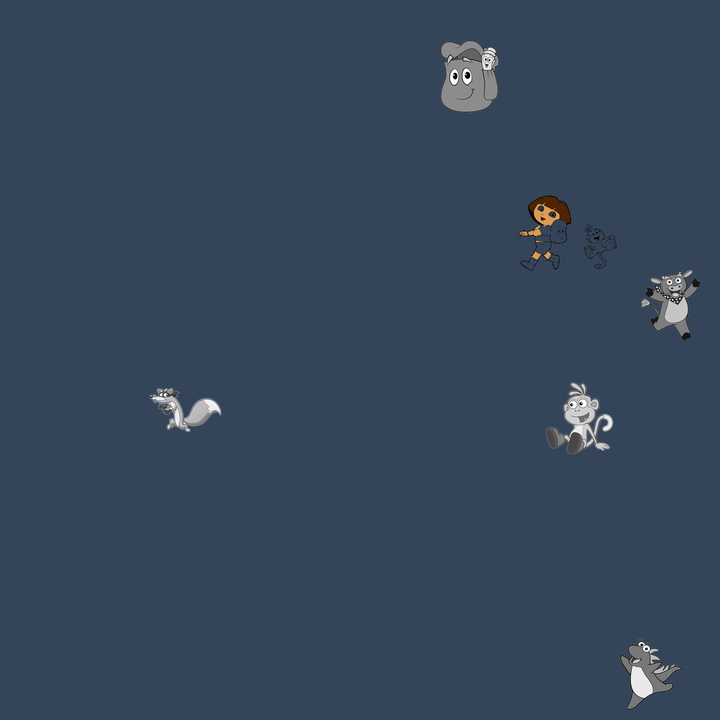
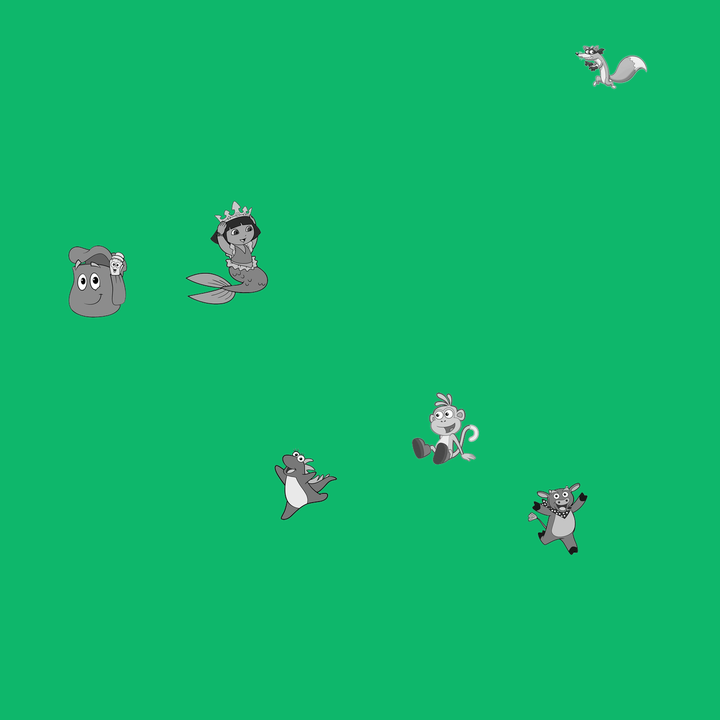
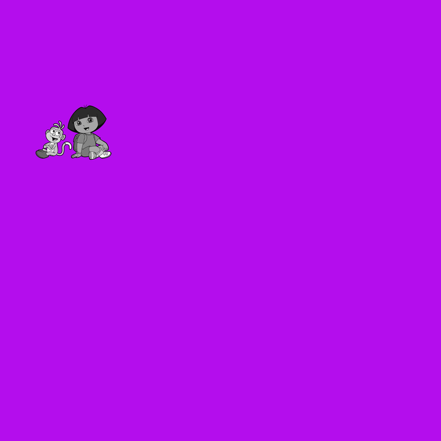

# HackIMCTF organized by Nullcon

### Finding Dora

Challenge is closed now, but you can find source code  [here](https://github.com/nullcon/hackim-2020/tree/master/misc/dora).

``` nc misc.ctf.nullcon.net 8000 ```
Gives a text,
> Where's Dora? 1 for upper right, 2 for upper left, 3 for lower left, 4 for lower right

and

Gives a base64 string, on decoding we get a 720x720 png.
This is a randomly generated image.






#### Approach

+ In all images 5 gray characters are same, find all these 5 and replace with background color
+ Divide image in 4 quadrants
+ Find number of color pixels other than background color
+ The quadrant with dora image will have max color count, reply this answer to server **800** times :|


Divided code in 2 parts, one for connecting to server and sending answer and second to guess the answer from image.

Code worked without manual help.

To get code working I cropeed all the gray characters.

     

After removing all these gray character finding dora was easy.




Script ran for around 15 mins, and after 800 iterations got the flag.

 

**SCRIPTS**

main.py
```python
#!/usr/bin/python3
import socket
import os
from threading import Thread
from time import sleep
import glob
import img_rep as IR
import base64

#dora new
host="misc.ctf.nullcon.net"
#host="127.0.0.1"
port=8000

b64_buf=""

not_recvng_since=0

count_when_send=0

recv_count=0

def recv_p(s):
	
	global b64_buf
	global recv_count
	

	while True:
		
		
		data=s.recv(4096).decode().strip()
		if len(data) < 5:
			continue
		b64_buf+=data
		print("\rRcvd - "+str(len(data)),end="")
		
		recv_count+=1


def combiner(s):
	global b64_buf
	global recv_count
	global not_recvng_since
	global count_when_send

	prev_cnt=0
	img_data=""
	itrn=1
	while True:
		sleep(0.1)
		#do some
		if (recv_count != 0) and (recv_count != count_when_send) and (prev_cnt == recv_count):

			not_recvng_since+=1

		if not_recvng_since > 8:
		
			
			#stopped recieving
			temp_b64=b64_buf.strip()

			fh=open("b64","w")
			fh.write(temp_b64)
			fh.close()

			b64_buf=""
			try:
				img_data=base64.b64decode(temp_b64)
			except:
				print("base64 err\n generate files")
				#if invalid base64 , fix it and pause script
				input()
			
			fh=open("img.png","wb")
			fh.write(img_data)
			fh.close()

			
			#After sending input

			try:
				inpx1=IR.find_pos("img.png")
			except:
				pass

			if inpx1 == 0:
				print("need help")
				os.system("export DISPLAY=:0;xdg-open img.png")
				xin=input()
				xin=str(xin).encode()
				os.system("pkill ristretto")

			#print("image ans "+str(inpx1))
			if inpx1 !=0:
				xin=str(inpx1).encode()
			
			xin=xin+b"\n"
			print("itrtn "+str(itrn))
			

			s.send(xin)
			itrn+=1

			not_recvng_since=0
			count_when_send=recv_count

		prev_cnt=recv_count


s=socket.socket(socket.AF_INET,socket.SOCK_STREAM)
s.connect((host,port))
print(s.recv(1024).decode())
t_read=Thread(target=recv_p,args=(s,))
t_read.start()

t_comb=Thread(target=combiner,args=(s,))
t_comb.start()
```

img_rep.py
```python
from PIL import Image,ImageFilter
import sys
import os
import cv2
import numpy as np

first_pixel=[]


def find_nco(img_p):
	im = Image.open(img_p, 'r')
	#im=im.filter(ImageFilter.GaussianBlur(radius=10))

	R, G, B = im.convert('RGB').split()
	r = R.load()
	g = G.load()
	b = B.load()
	w, h = im.size

	global first_pixel

	nc=0
	#clrs=set()

	for i in range(w):
	    for j in range(h):
	    	this_px=[r[i,j],g[i,j],b[i,j]]
	    	if this_px != first_pixel:
	    		nc+=1
	 #   	clrs.add(tuple(this_px))
	    	

	return nc


def find_pos(filename):


	image=cv2.imread(filename)
	img_gray=cv2.cvtColor(image, cv2.COLOR_BGR2GRAY) 
	f=[]
	for i in range(6):
		template=cv2.imread("fuckers/fucker"+str(i)+".png",0)
		result = cv2.matchTemplate(img_gray,template,cv2.TM_CCOEFF_NORMED)
		f.append(np.unravel_index(result.argmax(),result.shape))

	im=Image.open(filename,'r')
	R, G, B = im.convert('RGB').split()
	r = R.load()
	g = G.load()
	b = B.load()
	w, h = im.size

	global first_pixel
	first_pixel=[r[2,2],g[2,2],b[2,2]]
	
	print(first_pixel)
	print(f)

	#clrs=set() #if gray character found color 100x100 area with bg color
	for x in range(5):
		for j in range(f[x][0]-30,f[x][0]+70):
		    for i in range(f[x][1]-30,f[x][1]+70):
		    	try:
			    	r[i,j]=first_pixel[0]
			    	g[i,j]=first_pixel[1]
			    	b[i,j]=first_pixel[2]
		    	except:
		    		pass
	im = Image.merge('RGB', (R, G, B))
	im.save("clean.png")

	os.system("convert -crop 360x360 clean.png tiles/tile%d.png")


	counts=[]
	#find_nco 
	#find no of colored pixels other than bg  color
	counts.append(find_nco("tiles/tile0.png"))
	counts.append(find_nco("tiles/tile1.png"))
	counts.append(find_nco("tiles/tile2.png"))
	counts.append(find_nco("tiles/tile3.png"))
	
	#print(counts)
	#return
	tmp_counts=counts[:]
	tmp_counts.sort()
	
	print()

	print(abs(tmp_counts[3]-tmp_counts[2]))
	#if top 2 count of nco is within range of 1000, then answer manually
	if abs(tmp_counts[3]-tmp_counts[2]) < 1000:
		#print(abs(tmp_counts[3]-tmp_counts[2]))
		xyz=0
	else:
		s=counts.index(max(counts))
		if s==0:
			xyz=2
		elif s==1:
			xyz=1
		elif s==2:
			xyz=3
		elif s==3:
			xyz=4

	return(xyz)


#print(find_pos(sys.argv[1]))
```


> For any queries/suggestions [@aencodeIN](https://twitter.com/aencodeIN)
